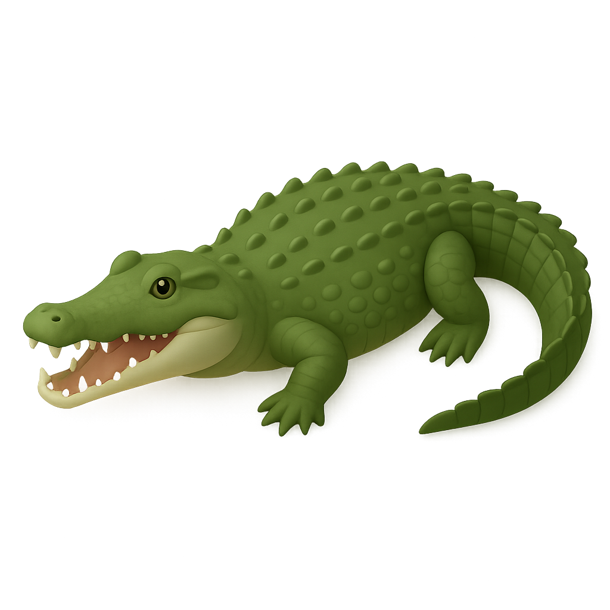

# Crocle

Crocle is web UI for croc. It runs as a Docker container, serves files and creates sub containers for file transfer.

## Development

1. Create a virtual environment.
2. Install dependencies.
3. Ensure Docker is running.

```bash
uv venv
source .venv/bin/activate
uv pip install -r requirements.txt
fastapi dev main.py
```
